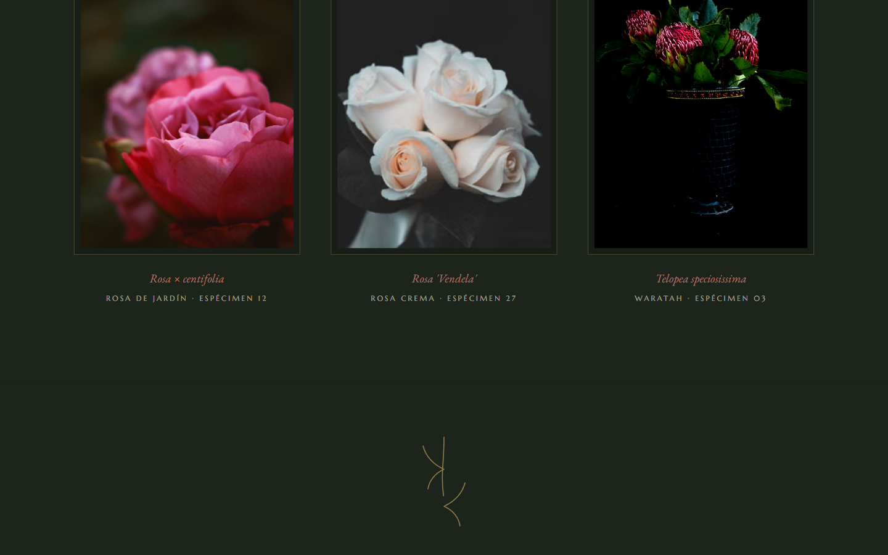

[English](README.en.md) · **Español**

# MADRIGAL · Florería de autor · Ramos de temporada

Ver en vivo: https://angeljgc-dev.github.io/madrigal-floreria/


Florería de autor con imágenes que se ven en 3D de verdad: fotografías con mapa de
profundidad que se inclinan y respiran siguiendo el cursor. La técnica es fake3d y está
hecha en WebGL1 crudo, sin frameworks.

| Hero | Sección |
| --- | --- |
|  |  |

## Técnicas

- **fake3d (estilo akella)**: un fragment shader desplaza el UV según el depth map
  (`uv + (depth - 0.5) * mouse / threshold`). Le puse un blur 5-tap del depth en GLSL para
  suavizar bordes, `mirrored()` en los límites, cover-fit por resolución y lerp 0.05.
- Cuando no hay cursor las fotos siguen moviéndose solas con una deriva senoidal.
- Cada fotografía va emparejada con su propio mapa de profundidad en escala de grises.
- Hay 4 instancias WebGL y si el contexto falla cae a ``.
- Gotcha que me tomó un rato: si los assets locales cargan antes que el layout, el canvas
  mide 0. Lo resolví re-midiendo con rAF y un `setTimeout` después de subir las texturas.
- Tipografía Italiana + Marcellus + EB Garamond; paleta de bodegón (#101511).

## Cómo correr

```bash
npx http-server . -p 8080
```

## Licencia

Código bajo licencia [MIT](LICENSE). MADRIGAL es una marca inventada para el portafolio, no
existe como negocio. Los recursos de terceros (fotos, videos y modelos 3D) conservan la
licencia de sus autores; los detalles están en Créditos.

## Créditos

Fotografía y video: [Pexels](https://www.pexels.com) · Técnica fake3d basada en el experimento
de Ashima/akella.

---
Ángel Josué García Canteros · Serie páginas-película.
